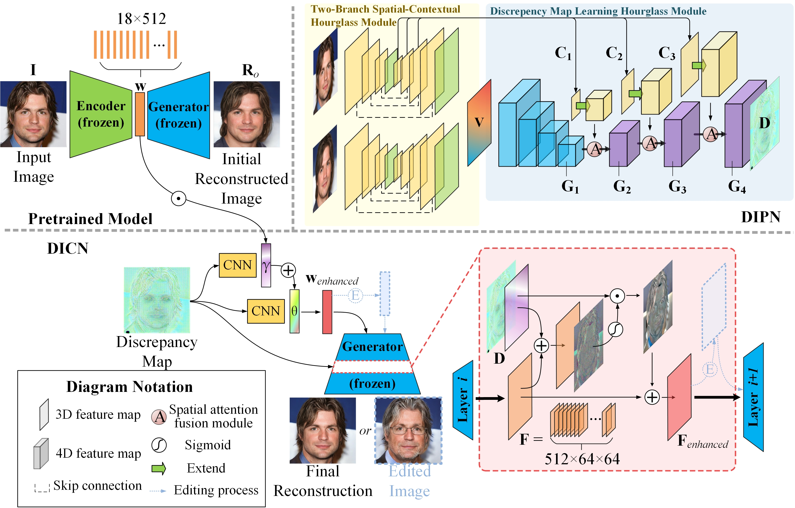

# Spatial-Contextual Discrepancy Information Compensation for GAN Inversion (AAAI 2024)
<a href="https://arxiv.org/abs/2312.07079"></a>
[](https://colab.research.google.com/drive/1OnU0Ox0kDV_h_qfqu5gHn0FWlwGpvQ8t?usp=sharing)

> Ziqiang Zhang, Yan Yan*, Jing-Hao Xue, Hanzi Wang
> 
> Most existing GAN inversion methods either achieve accurate reconstruction but lack editability or offer strong editability at the cost of fidelity. Hence, how to balance the distortion editability trade-off is a significant challenge for GAN inversion. To address this challenge, we introduce a novel spatial-contextual discrepancy information compensation-based GAN-inversion method (SDIC), which consists of a discrepancy information prediction network (DIPN) and a discrepancy information compensation network (DICN). SDIC follows a “compensate-and-edit” paradigm and successfully bridges the gap in image details between the original image and the reconstructed/edited image. On the one hand, DIPN encodes the multi-level spatial-contextual information of the original and initial reconstructed images and then predicts a spatial-contextual guided discrepancy map with two hourglass modules. In this way, a reliable discrepancy map that models the contextual relationship and captures fine-grained image details is learned. On the other hand, DICN incorporates the predicted discrepancy information into both the latent code and the GAN generator with different transformations, generating high-quality reconstructed/edited images. This effectively compensates for the loss of image details during GAN inversion. Both quantitative and qualitative experiments demonstrate that our proposed method achieves the excellent distortion-editability trade-off at a fast inference speed for both image inversion and editing tasks.

               

               


## Pipeline

DIPN contains a two-branch spatial-contextual hourglass module and a discrepancy map learning hourglass module. First, the original image I and the initial reconstructed image Ro (obtained by a pre-trained e4e model) are fed into DIPN to predict the discrepancy map. Then, the discrepancy map is fed into DICN for feature compensation in both the latent code and the GAN generator.
  

## Getting Started
### Installation
```
git clone https://github.com/ZzqLKED/SDIC.git
cd SDIC
```
### Environment
You can simply set up the environment by Anconda to make inference.
```
pip install timm
wget https://github.com/ninja-build/ninja/releases/download/v1.8.2/ninja-linux.zip
sudo unzip ninja-linux.zip -d /usr/local/bin/
sudo update-alternatives --install /usr/bin/ninja ninja /usr/local/bin/ninja 1 --force
pip install git+https://github.com/openai/CLIP.git
```
All dependencies for defining the environment are provided in `environment.yml`

### Pretrained Models
Please download the pre-trained models from the following links and put them in `./pretrained_models`.
| Path | Description
| :--- | :----------
|[SDIC for Face](https://drive.google.com/file/d/1-IcTTzXTNq_W8pNEC5tzN-srH0uzpKEW/view?usp=sharing)  | SDIC trained on the FFHQ dataset.
|[SDIC for Car](https://drive.google.com/file/d/1_Dfu06wuRqgFLXnc98HJv8QuBiLjrQgG/view?usp=sharing)  | SDIC trained on the LSUN dataset.

The following models are needed if you want to train SDIC from scratch.

| Path | Description
| :--- | :----------
|[FFHQ StyleGAN](https://drive.google.com/file/d/1EM87UquaoQmk17Q8d5kYIAHqu0dkYqdT/view?usp=sharing) | StyleGAN model pretrained on FFHQ taken from [rosinality](https://github.com/rosinality/stylegan2-pytorch) with 1024x1024 output resolution.
|[LSUN car StyleGAN](https://drive.google.com/file/d/1EM87UquaoQmk17Q8d5kYIAHqu0dkYqdT/view?usp=sharing) | StyleGAN model pretrained on FFHQ taken from [rosinality](https://github.com/rosinality/stylegan2-pytorch) with 512x512 output resolution.
|[IR-SE50 Model(for face)](https://drive.google.com/file/d/1KW7bjndL3QG3sxBbZxreGHigcCCpsDgn/view?usp=sharing) | Pretrained IR-SE50 model taken from [TreB1eN](https://github.com/TreB1eN/InsightFace_Pytorch) for ID loss calculation.
|[ResNet-50(for car)](https://drive.google.com/file/d/18rLcNGdteX5LwT7sv_F7HWr12HpVEzVe/view?usp=sharing) | Pretrained ResNet-50 model taken from [omertov](https://github.com/omertov/encoder4editing) for ID loss calculation.

- Download datasets and modify the dataset path in `./configs/paths_config.py accordingly`.
- Download some pretrained models and put them in `./pretrained_models`.
- If you want to train from on the LSUN dataset, note the image size and change `(18,144)` to `(16,144)` in line 210 of `models/encoders/encoders.py`.

## Train
Make sure the paths to the required models, as well as training and testing data are configured in `configs/path_configs.py` and `configs/data_configs.py`.Then Modify `options/` and training.sh and run:
